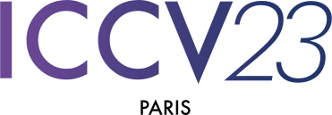
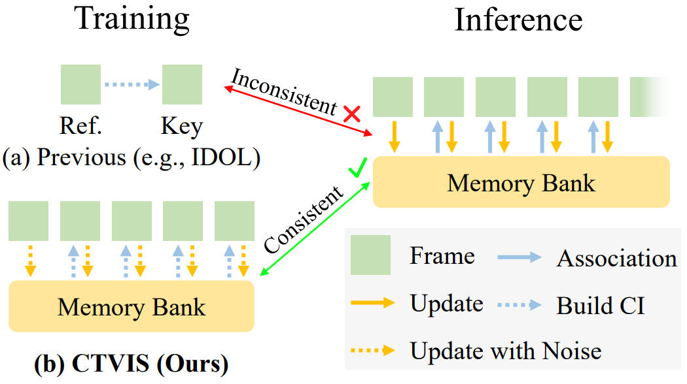

<div align="center">

<h2>CTVIS: Consistent Training for Online Video Instance Segmentation</h2>

[Kaining Ying](https://kainingying.github.io/)<sup>1,2*</sup>, &nbsp; Qing Zhong<sup>4*</sup>, &nbsp; [Weian Mao](https://scholar.google.com/citations?user=Qu-QXTsAAAAJ)<sup>4</sup>, &nbsp; [Zhenhua Wang](https://cie.nwsuaf.edu.cn/szdw/fjs/2022110082/index.htm)<sup>3#</sup>, &nbsp; [Hao Chen](https://stan-haochen.github.io/)<sup>1#</sup>

[Lin Yuanbo Wu](https://sites.google.com/site/linwuuq/)<sup>5</sup>, &nbsp; [Yifan Liu](https://irfanicmll.github.io/)<sup>4</sup>, &nbsp; Chenxiang Fan<sup>1</sup>, &nbsp; Yunzhi Zhuge<sup>4</sup>, &nbsp; [Chunhua Shen](https://cshen.github.io/)<sup>1</sup>

<sup>1</sup>[Zhejiang University](https://github.com/aim-uofa), &nbsp; <sup>2</sup>[Zhejiang University of Technology](http://www.english.zjut.edu.cn/)

<sup>3</sup>[Northwest A&F University](https://en.nwsuaf.edu.cn/), &nbsp; <sup>4</sup>[The University of Adelaide](https://www.adelaide.edu.au/), &nbsp; <sup>5</sup>[Swansea University](https://en.nwsuaf.edu.cn/)



<!-- https://github.com/KainingYing/CTVIS/assets/42159793/25273241-6642-46b4-9a47-bd19beec6f68.mp4 -->
</div>

## 📰 News

- [2023/07/14] Our work CTVIS is accepted by [**ICCV 2023**](https://iccv2023.thecvf.com/)! Congrats! ✌️
- [2023/07/24] ~~We will release the code ASAP. Stay tuned!~~
- [2023/07/31] We release the code and weights on YTVIS19_R50.

## 🔨 Install

Here we provide the command lines to build conda environment.
```shell
conda create -n ctvis python=3.10 -y 
conda activate ctvis
pip install torch==2.0.0 torchvision  

# install D2
git clone https://gitee.com/yingkaining/detectron2.git
python -m pip install -e detectron2

# install mmcv
pip install openmim
mim install "mmcv==1.7.1"

pip install -r requirements.txt
pip install setuptools==58.2.0 opencv-python

cd mask2former/modeling/pixel_decoder/ops
sh make.sh
cd ../../../../
```

## 🏀 Dataset Preparation

We recommend that you use the following format to organize the dataset format and refer to [this](https://github.com/sukjunhwang/VITA/blob/main/datasets/README.md) for more details.

```
$DETECTRON2_DATASETS
+-- coco
|   |
|   +-- annotations
|   |   |
|   |   +-- instances_{train,val}2017.json
|   |   +-- coco2ytvis2019_train.json
|   |   +-- coco2ytvis2021_train.json
|   |   +-- coco2ovis_train.json
|   |
|   +-- {train,val}2017
|       |
|       +-- *.jpg
|
+-- ytvis_2019
|   ...
|
+-- ytvis_2021
|   ...
|
+-- ovis
    ...
```

It is worthwhile to note that annotations `coco2ytvis2019_train.json`, `coco2ytvis2021_train.json` and `coco2ovis_train.json` are post-processing from following command:

```
python tools/convert_coco2ytvis.py
```

If you want to visualize the dataset, you can use the following script (YTVIS19):

```
python browse_datasets.py ytvis_2019_train --save-dir /path/to/save/dir
```

## ⚾️ Training and Evaluation

### Training

We use the weights of Mask2Former pretrained on MS-COCO as initional. You should download them first and place them in the `checkpoints/`.

Mask2Former-R50-COCO: [Official Download Link](https://dl.fbaipublicfiles.com/maskformer/mask2former/coco/instance/maskformer2_R50_bs16_50ep/model_final_3c8ec9.pkl)

Mask2Former-SwinL-COCO: [Official Download Link](https://dl.fbaipublicfiles.com/maskformer/mask2former/coco/instance/maskformer2_swin_large_IN21k_384_bs16_100ep/model_final_e5f453.pkl)

Next you can train CTVIS, for example on YTVIS19 using R50.
```
python train_ctvis.py --config-file configs/ytvis_2019/CTVIS_R50.yaml --num-gpus 8 OUTPUT_DIR work_dirs/CTVIS_YTVIS19_R50
```

### Evaluation

Typically during training, the model is evaluated on the validation set periodically. I can also evaluate the model separately, like this:

```
python train_ctvis.py --config-file configs/ytvis_2019/CTVIS_R50.yaml --eval-only --num-gpus 8 OUTPUT_DIR work_dirs/CTVIS_YTVIS19_R50 MODEL.WEIGHTS /path/to/model/weight/file
```

You can download the model weights in Model Zoo. Finally, we need to submit the submission files to the CodaLab to get the `AP`. We recommend using following scripts to push the submission to CodaLab. We appeariate this [project](https://github.com/rajatkoner08/InstanceFormer) for providing such useful feature.

```
python tools/codalab_upload.py --result-dir /path/to/your/submission/dir --id ytvis19 --account your_codalab_account_email --password your_codalab_account_password
```

### Demo and Visualization

We support inference on specified videos (`demo/demo.py`) as well as visualization of all videos in a given dataset (`demo/visualize_all_videos.py`).

```
# demo
python demo/demo.py --config-file configs/ytvis_2019/CTVIS_R50.yaml --video-input --output /path/to/save/output --save-frames --opts MODEL.WEIGHTS /path/to/your/checkpoint
```


## 💽 Model Zoo

### YouTube-VIS 2019

| Model                                      | Backbone             | AP   | AP50 | AP75 | AR1  | AR10 | Link                                                                                                             |
| ------------------------------------------ | -------------------- | ---- | ---- | ---- | ---- | ---- | ---------------------------------------------------------------------------------------------------------------- |
| [CTVIS](configs/ytvis_2019/CTVIS_R50.yaml) | ResNet-50            | 55.2 | 79.5 | 60.2 | 51.3 | 63.7 | [1Drive](https://onedrive.live.com/?authkey=%21ANWpOk9OYOes5e8&id=C2B61E01A0E33EA5%2128353&cid=C2B61E01A0E33EA5) |
| CTVIS                                      | Swin-L (200 queries) | 65.6 | 87.7 | 72.2 | 56.5 | 70.4 |                                                                                                                  |

### YouTube-VIS 2021

| Model | Backbone             | AP   | AP50 | AP75 | AR1  | AR10 | Link |
| ----- | -------------------- | ---- | ---- | ---- | ---- | ---- | ---- |
| CTVIS | ResNet-50            | 50.1 | 73.7 | 54.7 | 41.8 | 59.5 |      |
| CTVIS | Swin-L (200 queries) | 61.2 | 84   | 68.8 | 48   | 65.8 |      |

### YouTube-VIS 2022

**Note**: YouTube-VIS 2022 shares the same training set as YouTube-VIS 2021.

| Model | Backbone             | AP   | APS  | APL  | Link |
| ----- | -------------------- | ---- | ---- | ---- | ---- |
| CTVIS | ResNet-50            | 44.9 | 50.3 | 39.4 |      |
| CTVIS | Swin-L (200 queries) | 53.8 | 61.2 | 46.4 |      |

### OVIS

| Model | Backbone             | AP   | AP50 | AP75 | AR1  | AR10 | Link |
| ----- | -------------------- | ---- | ---- | ---- | ---- | ---- | ---- |
| CTVIS | ResNet-50            | 35.5 | 60.8 | 34.9 | 16.1 | 41.9 |      |
| CTVIS | Swin-L (200 queries) | 46.9 | 71.5 | 47.5 | 19.1 | 52.1 |      |


## 🫡 Acknowledgements

We sincerely appreciate [HIGH-FLYER](https://www.high-flyer.cn/) for providing the valuable computational resources. At the same time, we would like to express our gratitude to the following open source projects for their inspirations:

- [IDOL](https://github.com/wjf5203/VNext)
- [VITA](https://github.com/sukjunhwang/VITA)
- [Mask2Former](https://github.com/facebookresearch/Mask2Former)
- [MINVIS](https://github.com/NVlabs/MinVIS)

## 🪪 Lincese

The content of this project itself is licensed under [LICENSE](LICENSE).

## 📇 Cite our Paper

If you found this project useful for your paper, please kindly cite our paper.

```
@misc{ying2023ctvis,
      title={{CTVIS}: {C}onsistent {T}raining for {O}nline {V}ideo {I}nstance {S}egmentation}, 
      author={Kaining Ying and Qing Zhong and Weian Mao and Zhenhua Wang and Hao Chen and Lin Yuanbo Wu and Yifan Liu and Chengxiang Fan and Yunzhi Zhuge and Chunhua Shen},
      year={2023},
      eprint={2307.12616},
      archivePrefix={arXiv},
      primaryClass={cs.CV}
}
```
